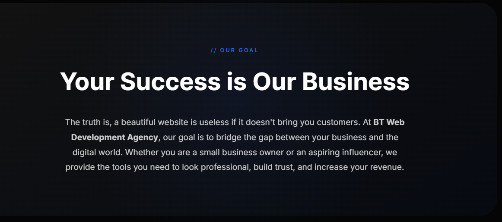

#

WEB DESIGNN AGENCY (PROJECT)

#

AGENCY NAME
AGENCY LOGO
SOCIAL MEDIA (SOCIAL MEDIA PAGE TEXT)
HELPING SERVICE BASED BUSINESSES GROW ONLINE
100% CLIENT SATISFACTION RATE
GET IN TOUCH

#

LEARN FRAMER

#

build figma, webflow, or framer level websites
focus on mobile form as well (most people use their phones)

#

ISSUES IN MOBILE FORM

HAMBURGER MENU DOES NOT HAVE CLOSE ICON AFTER ITS OPENED

ICONS IN FOOTER AINT SHOWING

ICONS SHOULD BE ADDED BESIDEEACH CONTACT TEXT WHATSAPP, IG , GMAIOL AND CALL US

PROJECT SLIDESHOWS SHOULD HAVE A DIFFERENT VIEW METHOD ON PHONE {THE BOX HOLDING THE IMAGES SHOULD BE THE SIZE BE THE SAME OR A BIT MORE THAT THE IMAGE ACTUAL SIZE , WITH THAT THE AUTO SCROLL IS NO LONGER NEEDED IN MOBILE FORM BUT THE NAVIGATION BUTTON TO SHOW OTHER IMAGES SHOULD STILL BE THERE} NOTE THAT THESE CHANGES ARE FOR THE MOBILE MODE ONLY

EACH SOCIAL LINK SHOULD BE LINKED WITH ITS LINK

REPHRASE THE TEXTS IN THE ABOUT AND GOAL SECTIONS

CHANGE NAV LINKS TO SOMETHING ELSE LIKE (SHOWCASE , GOALS , CONTACT US).

IN DESKTOP FORM , MAKE THE IMAGES SHOW LIKE PRICING CARDS, AND THE IMAGE SHOULD STOP AUTO SCROLLING , TRY THIWS AND SEE IF IT'LL WORK OR LOOK GOOD

OUR GOAL PART IS NOT THERE IN THE WEBSITE
REFERENCE CODE
<section class="mission glass">

// OUR GOAL
<h2>Your Success is Our Business</h2>

The truth is, a beautiful website is useless if it doesn't bring you
customers. At <strong>BT Web Development Agency</strong>, our goal is
to bridge the gap between your business and the digital world. Whether
you are a small business owner or an aspiring influencer, we provide
the tools you need to look professional, build trust, and increase
your revenue.

</section>
